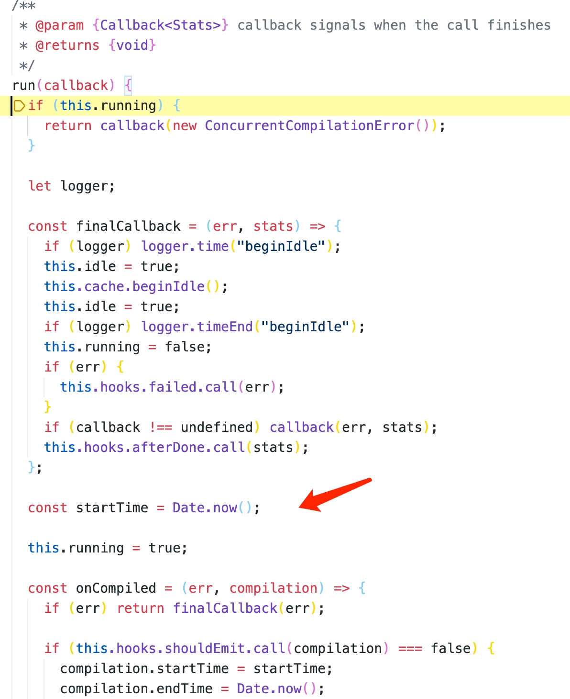
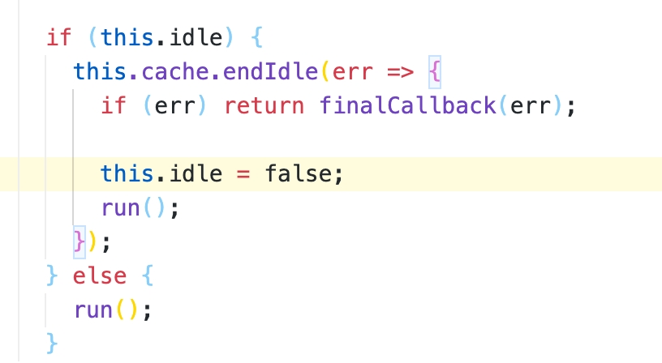
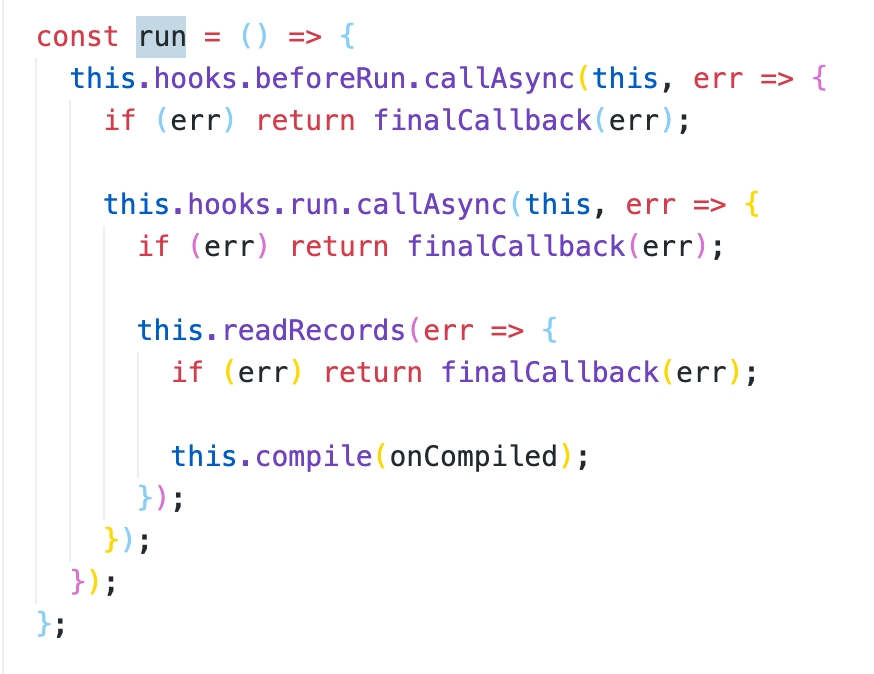
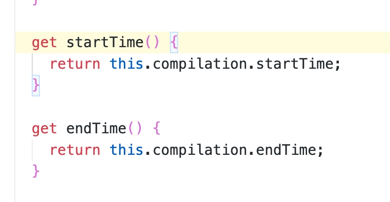
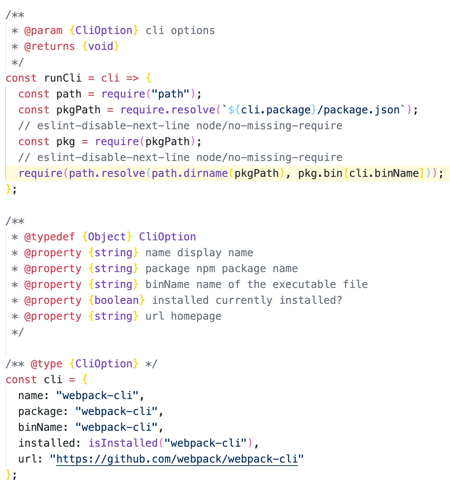
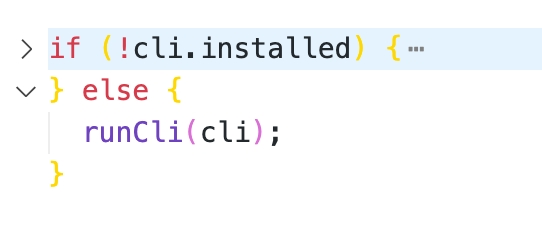

# 使用 node api 学习 webpack​

1. 使用 webpack api 打包一个最简的 js 资源

   

2. 你所使用含有 webpack 的项目中，webpack 是通过 webpack-cli 打包的吗？

   是，nextjs 和 umijs 2.直播后明白并不是，nextjs 和 umijsj 将 webpack 包直接放入 compiled 文件夹 ，防止依赖更新带来的问题，所以是 api 打包的

3. 如何计算每次 webpack 构建时间

   stat.toJson().time
   stat.endTime - stat.statTime

4. 断点调试 webpack 源码，了解其编译时间（startTime/endTime）是如何计算的

   首先进入 run 函数
   
   可以看到直接定义了 startTime
   下面是要找 endTime
   先看最后的调用逻辑
   

   如果是判断是否闲置，两种情况都执行内部的 run 函数
   

   再看 run 函数，如果错误执行的 finalCallback 把 err 传给用户，没有错误则执行 onCompiled 函数
   

   这里便赋值了 startTime 和 endTime，compilation 对象是在调用 onCompiled 时由 webpack 实例的 compile 编译函数传过来的参数
   然后 new Stats 生成 stats 实例，实例根据 Stats 里定义的
   

   get 函数即可访问 startTime 和 endTime

5. 断点调试执行 webpack 命令时的流程，体验它是如何在 webpack/webpack-cli 间相互调用的

   首先执行 webpack/bin/webpack.js
   

   其中 runCli 函数根据传入的 cli 对象拼接路径，加载 webpack-cli/bin/cli.js
   pkg.bin[cli.binName]即 pkg.bin['webpack-cli']
   webpack-cli 的 package.json 里配置了 bin
   ![z-1-8]./img/z-1-8.jpg)

   调用逻辑是判断是否安装 webpack，未安装时引导安装，已安装则直接调用 webpack-cli
   
