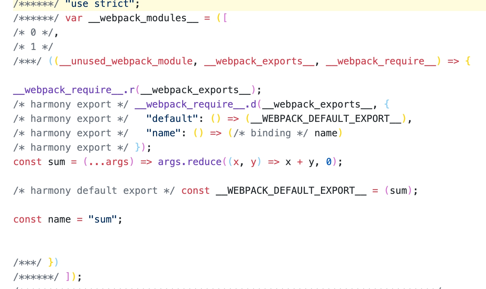

# esm to cjs

1. 对含 ESM 模块的 webpack 运行时代码进行调试与理解

   ok

2. webpack 含 ESM 的运行时代码做了那些事情

   首先根据 ast 生成的`__webpack_module__`的中用`__webpack_require__`的属性方法，r 给 `__webpack_exports__`添加鉴别是 esm 模块的属性，d 将导出的属性用 getter(setter)定义，
   属性在下方声明是因为访问时已经赋值
   

   缓存和`__webpack_require__`同 cjsm 模块
   

   定义`__webpack_require__`的属性方法，r,d,o
   

   先和`__webpack_module__`中模块一样执行 r,给入口模块添加 esm 标签，然后调用`__webpack_require__`返回 sum 模块的导出

3. `__webpack_require__` 中的 d/r/o 各个变量指什么意思

   - d:将 esm 导出的变量变成 exports 的 getter/setter 属性
   - r:给 exports 添加一个属性标志这是 esm 模块
   - o:相当于 Object 的 hasOwnProperty 方法
