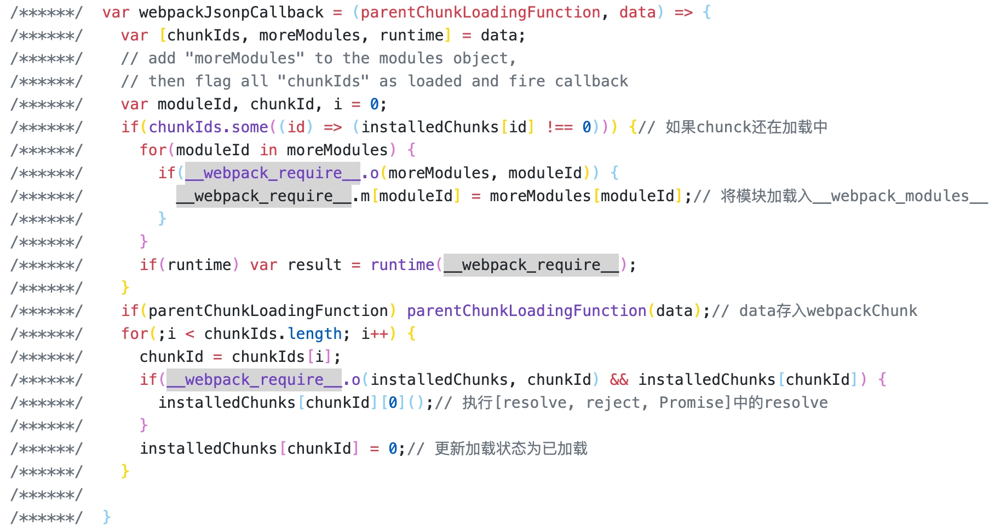

# code spliting 运行时分析

1. 对 code spliting 后的代码进行调试与理解

   见[代码中的注释](https://github.com/903040380/Xwebpack/tree/master/code-spliting/example/jsonp)

2. 将自己项目取消代码压缩进行打包，观察其打包后的代码骨架
   

3. 在 webpack 中如何实现 code spliting

   import() 动态导入

4. 在 webpack 中，加载 chunk 脚本的 JSONP Callback 如何实现

   

5. 当 output.chunkLoading 配置为 import 时，分析其源码

   

   `__webpack_require__.f.j`不同
   `__webpack_require__.l`不需要了

   

   jsonp 不需要了，用 installChunck 替代

6. 当代码分割时，async chunk 所对应的源代码发生变更时，该 async chunk 路径将会发生变化，而 entry chunk 中的`__webpack_require__.u` 内容也将发生变化，导致 entry chunk 的内容发生变更，随之路径发生变更，这将导致不必要的缓存失效，如何处理该问题。

   runtimeChunk 设置为 true 可以单独把 webpack 的运行时给独立出来，这样每次只重新请求 runtime 文件，nextjs 就是这样做的,见 hash 的增强章节
